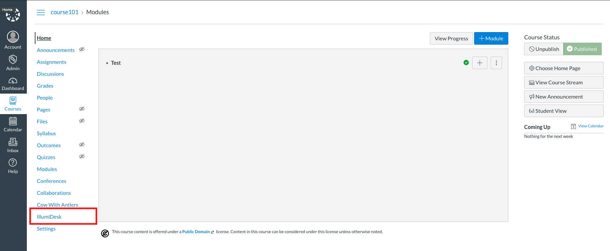
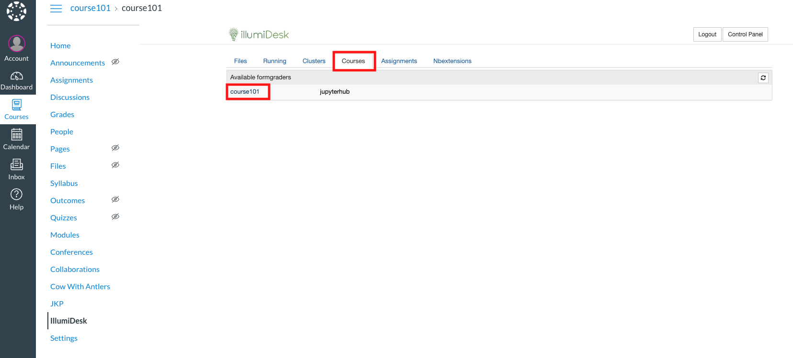
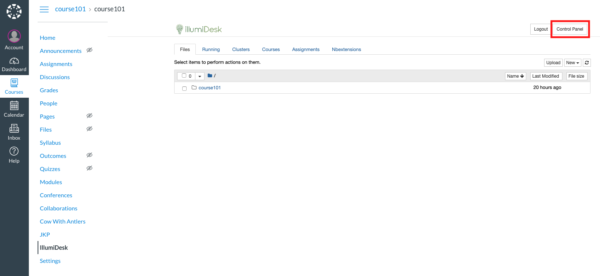
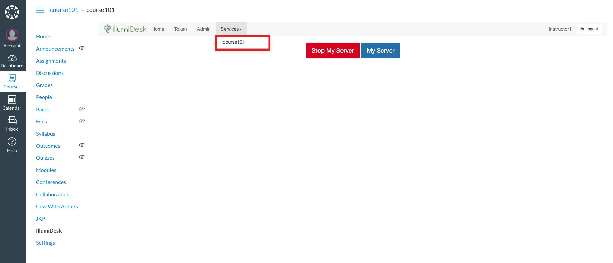
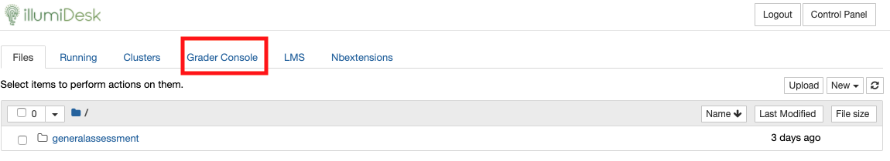
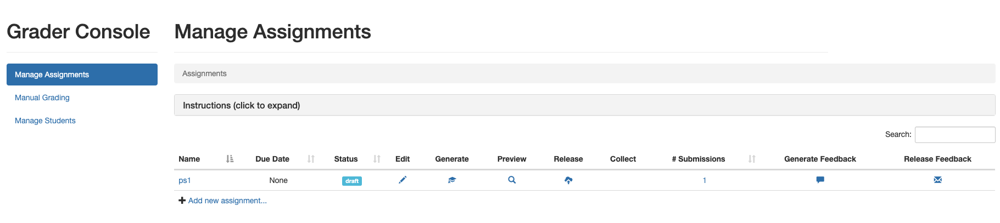

# Step 2: Access the Grader Console

### Checkpoint

To recap, you should now have:

* IllumiDesk application installed with LTI 1.1 or LTI 1.3 credentials
* IllumiDesk activated within your course
* Quickstart assignment located within your shared grader notebook


This article describes how to create your own source notebooks used for assignments, even though the [quickstart assignment was created with Step 1](create-a-quickstart-assignment.md). Feel free to [skip to Step 4](release-assignment-to-learners.md) if you already know how to create source assignment files.



#### Multiple Graders

IllumiDesk supports multiple graders for multiple courses using shared notebooks. Previously, only one instructor could complete all grading tasks for a course. Multiple graders open the possibility to have other course members help with grading tasks, such as Teachers Assistants.


Now we can focus on creating a new assignment from within IllumiDesk, releasing it to learners, and adding the Assignment link to the course page.

## Access Shared Grading Workspace

There are two types of solution Jupyter Notebooks:

* Jupyter Notebooks prepared for grading
* Jupyter Notebooks without grading cells

By `prepared for grading` we mean that the Jupyter Notebook is formatted in such a way to support `auto-grading and/or manual grading`. However, you can add your own Jupyter Notebooks which are not formatted for grading.

This step focuses on adding a Jupyter Notebook prepared for grading. A `solution notebook` is a Jupyter Notebook which is prepared for grading, meaning it has all the **questions and solutions within said notebook file**. Once distributed to learners, the grading service will replace solutions with placeholders so the learner knows where to add their own answers.

It's important to note that only the **shared grader notebook has access to the tools required to add, distribute, collect, and grade Jupyter Notebook files.**


#### Jupyter Notebook \(\*.ipynb\) Files

Although this section focuses on how to add Jupyter Notebooks prepared for grading, users may also add their own regular Jupyter Notebooks. The workflow of adding and distributing Jupyter Notebooks is the same, however, automated grading would not work.


### Creating a Source Notebook from the Grader Console

To get started, click on the IllumiDesk menu item to open your environment. For example, with the Canvas LMS the IllumiDesk tool is available by default within the course main menu:

Once you click on the IllumiDesk link to initiate a launch request, IllumiDesk will automatically start a new Jupyter Notebook for you you. This Jupyter Notebook is the user's own personal notebook! Users with the `Instructor` role are free to use this personal space for anything they wish, such as testing, creating new files, among other tasks.

If you would like to enable grading \(which is assumed for this portion of the getting started guide\), then you will need to access the **shared grader environment**. Shared grader environments are those where **multiple users have access to a shared grader notebook via group membership**.

Shared grader notebooks are aligned to these rules:

* Instructors that are members of the course are automatically added to the shared grader group
* Learners that are members of the course are not added to the shared grader group
* Only the shared grader notebooks have the auto-grading extensions enabled
* Each shared grader notebook is associated with one course for the LMS instance

There are two ways to get to the shared grader notebook:

1. Click on the `Courses` tab and then on the available course within the `Available formgraders` section:

 You can also access the shared grader notebook by clicking on the `Control Panel` button and then on the `Services` dropdown option:

 The screenshot below only has one example. If the user with the `Instructor` role is a member of the grader group in more than one course, then those courses would also appear in the dropdown:

With the shared grader notebook open, you now have the option to add your Jupyter Notebook solution files prepared for grading. Now click on the `Grader Console` tab to access the interface which you can use to complete your grading tasks:

Clicking on the `Grader Console` tab will open a new browser tab. This new browser tab will display the options available to you to start managing your assignment files:


#### Jupyter Notebook Resources

The user's available CPU and RAM will depend on the account. Basically the sky is the limit as the resources available are only limited by the resources assigned to the IllumiDesk-managed [containers](https://en.wikipedia.org/wiki/List_of_Linux_containers).



#### Support for GPU Instances

IllumiDesk offers support for GPU instances to those customers that require them. GPU instances are useful, although not required, for deep learning use cases.


Congrats! You now have the `Grader Console` open which you can use to complete your assignment related tasks.

In the next section, we will create a student version of the Jupyter Notebook assignment and distribute it to them.  

