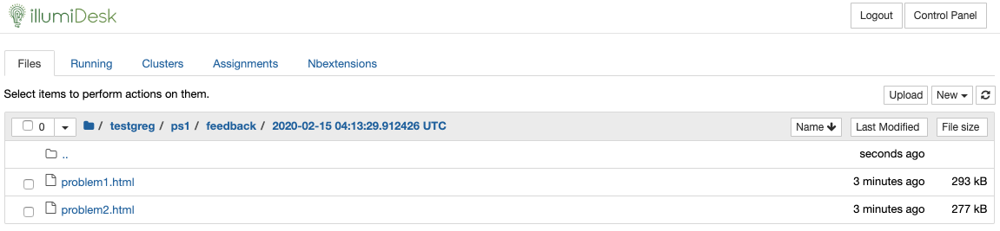

# Step 9: Collect Feedback from Graders

## Collect and View Feedback as a Learner

Collecting feedback as a student is a simple process. First, log in with a user that has the `Learner` role. The learner can either click on the `Assignment` link or click on the `IllumiDesk` menu item in the course navigation bar to view their workspace.

Fetch feedback as a learner by clicking on the Fetch Feedback button.

Once the user with the learner role clicks on the `Fetch Feedback` button, a `view feedback` link will appear next to the submission's timestamp:

Feedback is actually distributed back to the learner in static HTML format. This ensures that the document cannot be edited. Once the student clicks on the `view feedback` link, instead of viewing files as `*.ipynb` files they will see the `*.html` extension:

Clicking on any of the `*.html` files will provide the learner with a view of the notebook as a web page with the grader's comments. The learner can also confirm point values for individual cells.

Remember how, as a grader, we added comments to one of the cells in markdown format? As you can see below, IllumiDesk's services convert the markdown text and display it in the browser with standard HTML.

There is only one step left! The grader can now send all student grades to the Learning Management System \(LMS\). Let's access the LMS tab in the next section to complete this task.

