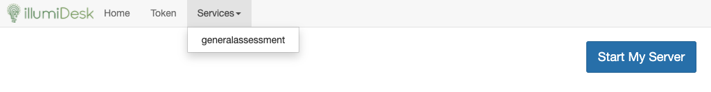
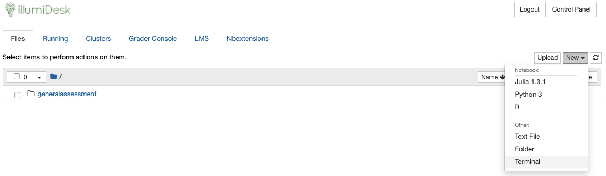
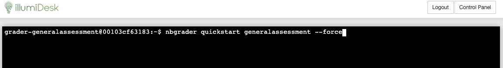

# Step 1: Create a Quickstart Assignment

Fortunately creating a Quick Start assignment is super simple! If you haven't done so already, make sure you have installed IllumiDesk as a tool with your Learning Management System \(LMS\).

* From within the LMS, click on the IllumiDesk menu item or link within your course
* Open your shared grader notebook from the IllumiDesk control panel by clicking on `Services --> Course Name`, where course name corresponds to your LMS course in lower case characters.

* Click on `New --> Terminal`

* Enter `nbgrader quickstart <course_name> --force`

* Close the terminal window
* Click on the `Grader Console` tab. Within the Grader Console, you should see a course titled `ps1`.

In the next section we will use this test assignment to emulate creating the source file, generate the student version of the assignment and release the assignment to the course's students.

