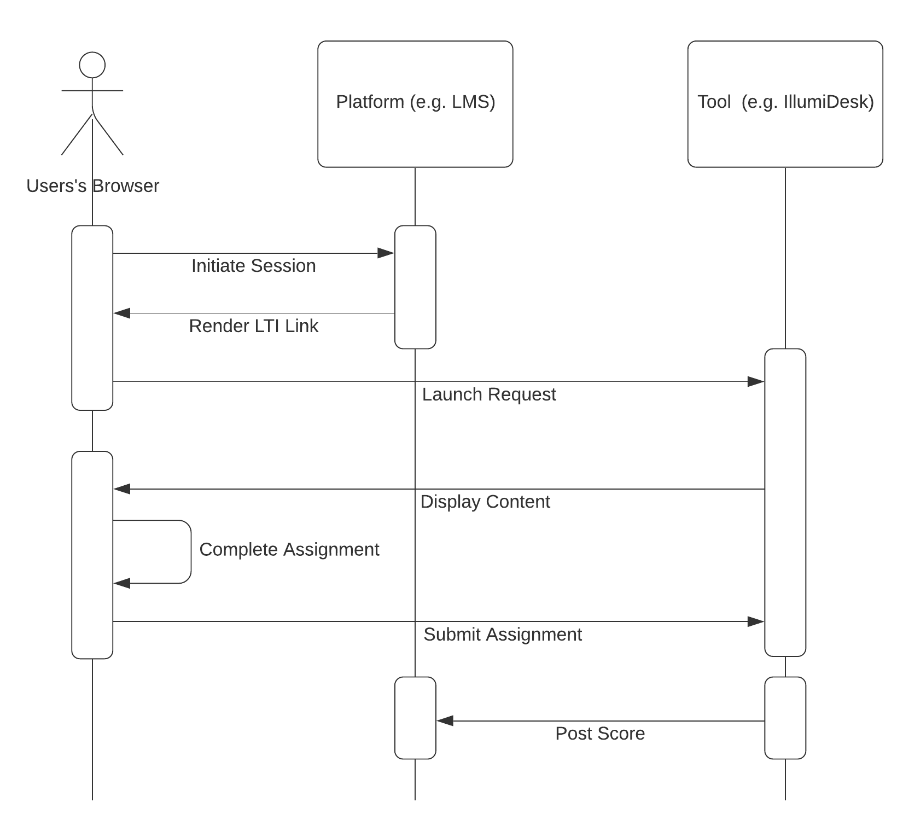

# Learning Tools Interoperability \(LTI\)

## IllumiDesk Integrations with LTI

Think of IllumiDesk as the [LTI compliant](https://www.imsglobal.org/activity/learning-tools-interoperability) bridge between your `Learning Management System (LMS)` and `Jupyter Notebooks`. There are two versions of the LTI standard: LTI 1.1 and LTI 1.3. IllumiDesk supports both versions of the LTI standard. This document will help you get a better grasp on the LTI standard to help determine which option is best for you.

## Learning Tools Interoperability \(LTI\) Overview

There are two main actors once you establish an **LTI integration**: the **Platform** and the **Tool**. The platform is usually associated with the Learning Management System \(LMS\), whereas the tool is usually associated to an external tool that enhances the platform to provide richer learning experiences. Within the context of LTI, **IllumiDesk is a Tool to enhance LMS's with Jupyter Notebooks**. There are two versions of the LTI standard:

1. [LTI 1.1](https://www.imsglobal.org/specs/ltiv1p1/implementation-guide)
2. [LTI 1.3](https://www.imsglobal.org/spec/lti/v1p3/)


The LTI 1.1 standard identifies the actors as tool consumers and tool providers. These terms are closely associated with the OAuth1 standard but have been re identified into more generic terms with LTI 1.3 as platforms and tools. For the purposes of this document, these terms are used interchangeably.


As the version suggests, the LTI 1.3 standard is the latest version and includes enhanced security and integration options.


The Learning Tools Interoperability® \(LTI®\) standards are maintained by the [IMS Global Learning Consortium](https://www.imsglobal.org/). IllumiDesk is an active **Learning Tools & Content Alliance Member** and has [certified the application](https://site.imsglobal.org/certifications/illumidesk-llc/illumidesk#cert_pane_nid_186771) with the latest versions of the LTI standard.


### LTI Requests

LTI 1.1 defines `launch requests` as the action to initiate a session between the end-user' browser and the tool. LTI 1.3 requests are broader in scope, since it's also feasible to initiate the flow using services that aren't directly associated with the end-user's browser. With LTI 1.1, launch requests include arguments within the request's body as form data. LTI 1.3, on the other hand, defines mechanisms to encode the JSON payload as a `JWT`, thus converting top-level properties within the JSON document to `claims`.

The illustration below provides a general overview of how the end-user, platform and tool interact with each other during an LTI launch 1.1 launch request and assignment submission flow:

The LTI standard establishes the required, recommended, and optional parameters and claims that should be included with v1.1 and v1.3, respectively. For example, with LTI 1.1 the `lti_version` is a required field and the `roles` field is a recommended field. LTI 1.3 defines other rules, such as requiring the `resource_link_id` claim.

Regardless of the LTI version, IllumiDesk uses the general steps below to handle LTI requests:

1. Identify the end-user or service that initiated the launch request. With LTI v1.1 this is known as the `consumer key` and with LTI 1.3 this is known as the `client id`used in combination with other properties such as the `deployment_id`.
2. Parse and decode the request body, which includes but is not limited to ensuring proper encoding and parameter/claim types.
3. Verify messages to ensure authentication \(user is who they say they are\), authorization \(user has the correct permissions\), integrity \(launch request fields/values have not been manipulated in transit\), and confidentiality \(messages are not open to prying eyes\).

Additional differences between LTI v1.1 and LTI v1.3 are:

* **LTI v1.3. builds on LTI v1.1** authentication and message content by incorporating new standards to improve security and extensibility features. LTI v1.3 defines an [`LTI Core`](https://www.imsglobal.org/spec/lti/v1p3/) specification and the [`LTI Advantage`](https://www.imsglobal.org/ltiadvantage) specification. The LTI Advantage specifications include [`Assignment and Grades Services`](https://www.imsglobal.org/spec/lti-ags/v2p0/), [`Names and Roles Provisioning Services`](https://www.imsglobal.org/spec/lti-nrps/v2p0), and [`Deep Linking`](https://www.imsglobal.org/spec/lti-dl/v2p0). 
* **LTI v1.3 is more secure** as it uses the latest techniques to authenticate and authorize messages and services with `OAuth2` and `OIDC`. LTI v1.1, on the other hand, relies on the older `OAuth1` standard. 
* LTI v1.1 defines a configuration document using `XML` \(known as the `LTI Cartridge` format\) whereas LTI v1.3 defines a `JSON`-based configuration document.
* With **LTI 1.1** arguments are sent as **form-encoded data** within the message body. LTI 1.3 relies on **JWT's** within the message body to included LTI arguments as **claims**.


Although LTI v1.3 uses `OAuth2` and `OIDC` as the underlying security standards for authentication and authorization, it does not consider the use of federated identity providers for single sign on \(SSO\).


IMS Global recommends all platforms and tools to **migrate to LTI v1.3** as it provides more security and extensibility options.


## IllumiDesk Long Term Support \(LTS\) of LTI v1.1

IllumiDesk supports both the LTI v1.1 and LTI v1.3 standards. However, some newer features are only enabled with LTI v1.3. IllumiDesk's product team plans on a formal deprecation notice during December of 2020 with a 1 year window to allow customers to migrate their integrations from LTI v.1.1 to LTI v1.3 during the course of the 2021 calendar year.


Now that you have a basic grasp of the LTI concepts, let's move on to the next sections to install IllumiDesk with your Learning Management System!

