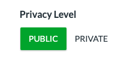

# Security and Privacy

## Security and Privacy Settings

IllumiDesk takes security and privacy matters very seriously. Fortunately, the LTI standard provides platform and tool vendors to adjust their security and privacy settings to comply with their local requirements.

The data exchanged between the platform \(typically and LMS\) and IllumiDesk depends in large part on the privacy settings that are set when installing IllumiDesk as an External Tool. To alleviate some of the concerns from our customers, IllumiDesk can now work when the application is installed when the `Privacy Level` is set to `Private`.

For example, when using the Canvas LMS with LTI v1.3, LMS administrators have the option to toggle the privacy setting from `Public to Private` when installing or updating the `Developer Key` associated with the External Tool application.

Regardless of whether privacy settings are set to public or private, IllumIDesk receives the following data points from the LMS:

* `Course id` \(integer, such as 28\)
* `Context label` \(string, such as course101\)

When IllumiDesk is installed with `public settings` the personal data points exchanged between the LMS and IllumiDesk are:

* User full name \(first and last name, such as Jane Perez\)
* User email \(full email address, such as jane@example.com\)
* User given name \(string, such as jane\)
* LMS user\_id \(integer value, such as 2367\)
* User role \(one of: instructor, learner, or grader\)

When private, the only data point received is the `user_id`, which according to the LTI standard is an integer value created and managed by the LMS.

## How Privacy Settings Influence User Experience

When IllumiDesk is installed as an external tool with privacy settings toggled to the `private` position, then all features work the same as they do when toggled to `public`.

However, certain elements within the user experience change, specifically:

* When the application is set to private, the integer which corresponds to the user name appears within the IllumiDesk / Jupyter Notebook header
* Instructors will not have access to student names within the grading tools

Once grades and/or assignments are sent to the LMS, the user ids are associated with the LMS's user record managed by the LMS itself. At that point, the instructor\(s\) have access to view grades by student name or any other feature managed by the LMS.

## Learning Management System Administrators

Many organizations have dedicated Learning Management System \(LMS\) administrators which must comply with various requirements before approving an External Tool installation. This process may take days or it may take months depending on the organization.


#### LMS Sandboxes

IllumiDesk may offer some of the more popular LMS's with a developer license. Please contact us if you need access to an LMS while the vetting process completes.


## What's Next?

Now that you have your LMS set up with IllumiDesk you can start creating your first course.

