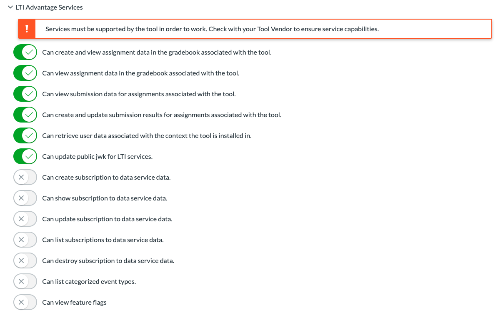
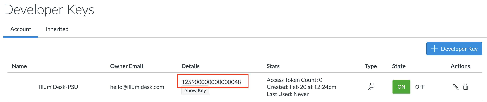
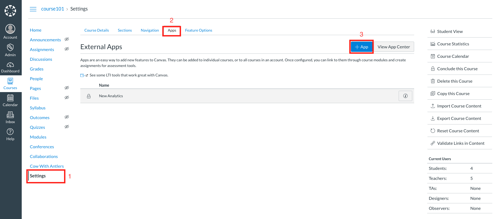
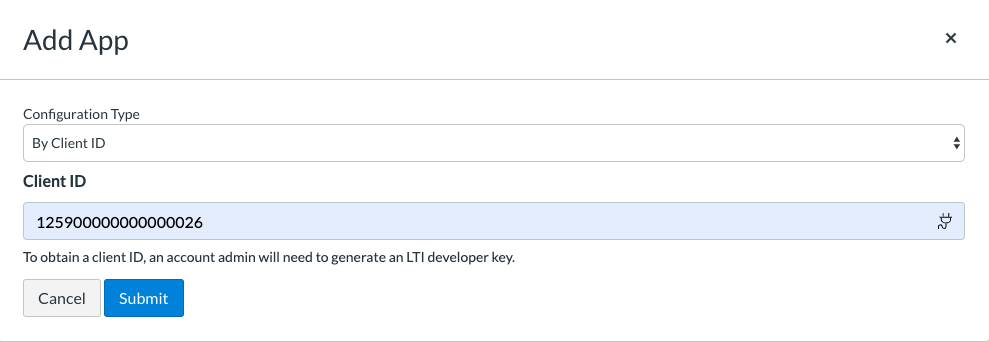

# Step 1: Install IllumiDesk with the Canvas LMS


#### LTI 1.1 deprecation notice

IllumiDesk only supports LTI v1.3 with IllumiDesk v2.0. LTI 1.1 with IllumiDesk v1.4 will be deprecated at the end of December 2020. Until that time, IllumiDesk v1.4 will only receive security and maintenance updates.


## Integrate IllumiDesk with your Canvas LMS

Think of IllumiDesk as the [LTI compliant](https://www.imsglobal.org/activity/learning-tools-interoperability) bridge between your `Learning Management System (LMS)` and `Jupyter Notebooks`. To set up the integration, you only need to follow three simple steps:


#### Canvas LMS Developer Key Documentation

Please refer to the [Canvas LMS documentation located here](https://community.canvaslms.com/docs/DOC-16729-42141110178) to obtain more detailed instructions.


For more detailed instructions on how to install an LTI 1.3 developer key, [please refer to this post](https://community.canvaslms.com/docs/DOC-16729-42141110178).

## Create IllumiDesk Developer Key

If you are getting started with IllumIDesk's multi-tenant solution, you can use this JWKS link to get started: [https://my.illumidesk.com/hub/jwks](https://my.illumidesk.com/hub/jwks).

There may be cases where it is more convenient to use your own custom sub-domain. To use a custom domain, replace `my.illumidesk.com` with `{org_name}.illumidesk.com` in the instructions below, where `{org_name}` is the name that represents your sub-domain.

**Developer Key Installation Steps**

1.Obtain JWKS by navigating to [https://my.illumidesk.com/hub/jwks](https://my.illumidesk.com/hub/jwks)

You can also copy/paste the JSON which should look like the one below:  


```text
{
    "keys": [
        {
            "kty": "RSA",
            "alg": "RS256",
            "use": "sig",
            "kid": "da5193bd2f502342fc4a7e8fc0f98cb2",
            "n": "7zY7dKGhzu5-5WkYeQybuQf_-66Y8cpYQ3NybaPDzV-aCssZ1N5A8WYDOWJO0nOdhV_j2kVxqGVKR7tPNngnsFW3iNJesfSl1fm6XMtSAlh9eXrmnkiiP_xrJh_0VV6gVUOeMXSp_85tszs4j1UEozFZHskYVfQiidShZr2ZCfToXI0m44HKCUtMcwXs0og3ZxMOkXmooe7UmlhGUIg4srmlQEP6V7gy2MLXupkNZhNQuNSaMdCYrgs9Nvd10-vLddxmUGv55_TI34wt0j6wZ7c8-ZVLjhYBwYcZCZgTDFRDspKc5_0Y1zFAmVGX8H9tLFO8xS1s857AJahhnnW7F8b2qJ4QS-KAmJDN35MBcWinmaRAL-vzLXcU3eKwk3diYTdfW9EseekRsMVC-zTOp_5QX7vrsM2BsLPrmK0D0I9rjU9zv9mTIBvdbSvd169sn8mj-BKiKM6C8NI2xezN-QbFsiHWJtiMF71DO3KjA7pxXSI3IUv5fBqYLCE1oOEU6oyh7ZW2ibPDaifas9AaO00zT6Whg2yBtyIIMe7yQqQreId9UZ4doEUk40Lt2T31WoLcm6yt7bhHiumbhLzyIvyY7BWV951Jp0MLFHmCHuA_WqHfqaV8tKMFwpuI5-deokHWtm8Vxl46aKcxPhUjsZng-ZQJv3e6t3rlg-OIxC0",
            "e": "AQAB"
        }
    ]
}
```


If you copy/paste the JSON from the link, make sure you don't include the first and last squiggly, key, and bracket. For example, the JSON online would include:

`{"keys": [ {"kty": ... "AQAB"} ] }`

For the example above, paste the values so they look like so:

`{"kty": ... "AQAB"}`

 2. Navigate to **Account --&gt; Developer Keys --&gt; + Developer Key --&gt; + LTI Key**. Then select the Paste JSON Configuration method. Paste the configuration JSON into the **LTI 1.3 Text Box**.

3. Populate the fields with the following information:

| Field Name  | Value  |
| :--- | :--- |
| **Redirect URI** | [https://my.illumidesk.com/hub/oauth\_callback
](https://my.illumidesk.com/hub/oauth_callback

) |
| **Configure Method** | Manual Entry |
| **Target Link URI** | [https://my.illumidesk.com/hub
](https://my.illumidesk.com/hub

) |
| **OpenID Connect Initiation Url** | [https://my.illumidesk.com/hub/oauth\_login
](https://my.illumidesk.com/hub/oauth_login

) |
| **LTI Advantage Services** | \(Recommended\) Toggle all options to the on position. |
| **JWK Method** —&gt; **Public JWK URL** | [https://my.illumidesk.com/hub/jwks
](https://my.illumidesk.com/hub/jwks

) |
| **Additional Settings** —&gt; **Public JWK URL**  | [https://my.illumidesk.com/hub/jwks
](https://my.illumidesk.com/hub/jwks

) |
| **Placements** | `Course Navigation`, `Assignment Selection` |
| **Course Navigation** —&gt; **Target Link URI** | [https://my.illumidesk.com/hub/
](https://my.illumidesk.com/hub/

) |
| **Assignment Selection** —&gt; **Target Link URI**  | [https://my.illumidesk.com/hub/file-select
 
](https://my.illumidesk.com/hub/file-select

)  |


#### LTI Advantage Services

IllumIDesk does not need all LTI Advantage services switched to the on the position at this time. At a minimum, IllumiDesk does not require `subscription to data service data` options, `list categorized event types`, and `view feature flags`.


The screenshot below demonstrates the minimum options required in the `LTI Advantage Services` section.  




4. Add the IllumiDesk application to your Canvas LMS which should create a `Client ID` that represents the application.



5. Navigate to Course --&gt; Settings.

6. Click on the Apps tab then + Apps button.



7. Activate IllumiDesk within your course selecting the Client ID option and pasting the Client ID obtained from step 4.



8. Copy the `Client ID` string from the `Details` column and send it to us via email to `support@illumidesk.com`. An IllumiDesk team member will then activate your account using the provided `Client ID`.

That's it! Once IllumiDesk is activated within your course all data will securely sync between systems using the LTI 1.3 standard.

Interested? Click on the link below to request your trial account today!



## Security and Privacy Settings

IllumiDesk takes security and privacy matters very seriously. It's the law, its good business, but, most importantly, it matters for our future generations.

The data exchanged between the LMS and IllumiDesk depends in large part on the privacy settings that are set when installing IllumiDesk as an External Tool. To alleviate some of the concerns from our customers, IllumiDesk can now work when the application is installed when the `Privacy Level` is set to `Private`.

For example, when using the Canvas LMS, admins have the option to toggle the privacy setting from `Public to Private` when installing or updating the `Developer Key` associated with the External Tool application.


Regardless of whether privacy settings are set to public or private, IllumIDesk receives the following data points from the LMS:

* Course id \(integer, such as 28\)
* Context label \(string, such as course101\)

When IllumiDesk is installed with `public settings` the personal data points exchanged between the LMS and IllumiDesk are:

* User full name \(first and last name, such as Jane Perez\)
* User email \(full email address, such as jane@example.com\)
* User given name \(string, such as jane\)
* LMS user\_id \(integer value, such as 2367\)
* User role \(one of: instructor, learner, or grader\)

When private, the only data point received is the `user_id`, which according to the LTI standard is an integer value created and managed by the LMS.

## How Privacy Settings Influence User Experience

When IllumiDesk is installed as an external tool with privacy settings toggled to the `private` position, then all features work the same as they do when toggled to `public`.

However, certain elements within the user experience change, specifically:

* When the application is set to private, the integer which corresponds to the user name appears within the IllumiDesk / Jupyter header
* Instructors will not have access to student names within the grading tools

Once grades and/or assignments are sent to the LMS, the user ids are associated with the LMS's user record managed by the LMS itself. At that point, the instructor\(s\) have access to view grades by student name or any other feature managed by the LMS.

## Learning Management System Administrators

Many organizations have dedicated Learning Management System \(LMS\) administrators which must comply with various requirements before approving an External Tool installation. This process may take days or it may take months depending on the organization.


#### LMS Sandboxes

IllumiDesk may offer some of the more popular LMS's with a developer license. Please contact us if you need access to an LMS while the vetting process completes.


## What's Next?

Now that you have your LMS set up with IllumiDesk you can start creating your first course.

