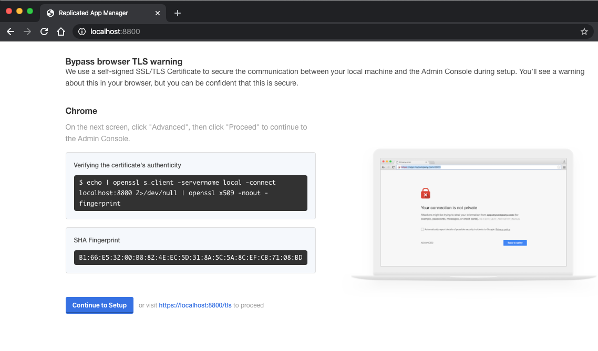
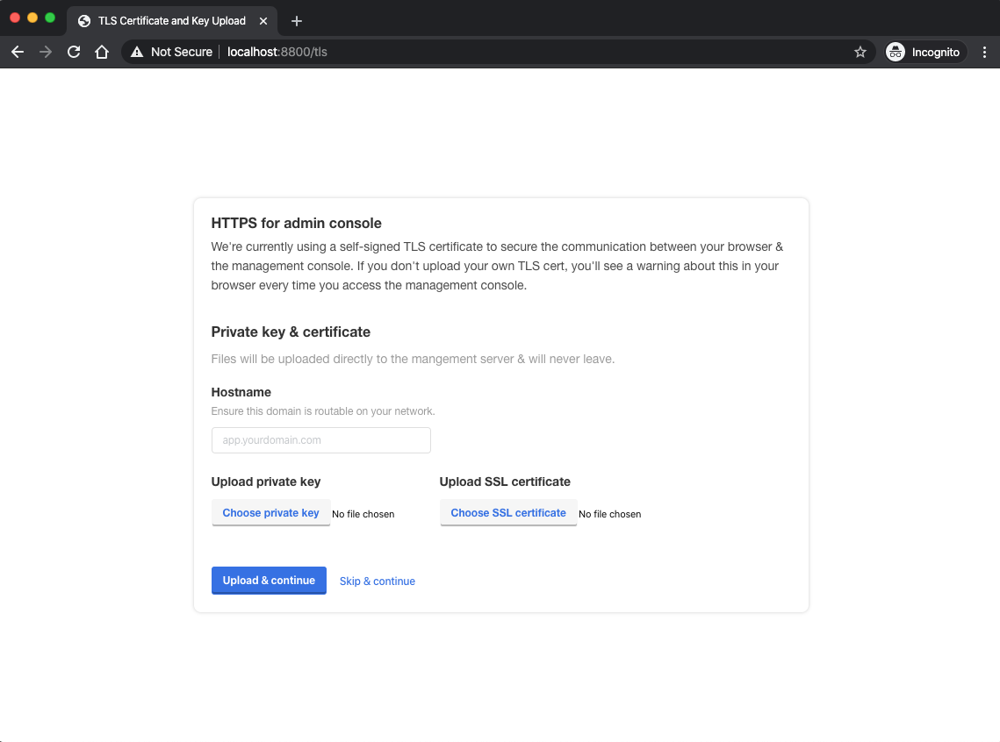

# Enable a TLS Certificate for your Admin Console

Once you have completed the installation of the initial setup up \(either with the [embedded]() or [attached]() option\) you'll be prompted to set up the **Admin Console** by directing your browser to **http://&lt;ip&gt;:8800**. Once you log in to the Admin Console with the provided password then the system will prompt you to update the site with a TLS certificate.


Although this is an optional setting we highly recommend securing access to your Admin Console with a valid TLS certificate to encrypt transactions from your local environment to the web-based Admin Console.


Only after the initial install will you be presented with a warning page:

The next page allows you to configure your TLS certificates:

To continue with the preinstalled self-signed TLS certificates, click "skip & continue". Otherwise, upload your signed TLS certificates as described on this page. The hostname is an optional field, and when it's specified, it's used to redirect your browser to the specified host.

Once you complete this process then you'll no longer be presented with this page when logging into the KOTS Admin console. If you direct your browser to **http://&lt;ip&gt;:8800** you'll always be redirected to **https://&lt;ip&gt;:8800**.

### TLS Secret

kURL will set up a Kubernetes secret called **kotsadm-tls**. The secret stores the TLS certificate, key, and hostname. Initially, the secret will have an annotation set called **acceptAnonymousUploads**. This indicates that a new TLS certificate can be uploaded as described above.

### Uploading new TLS Certs

If you've already gone through the setup process once, and you want to upload new TLS certificates, you must run this command to restore the ability to upload new TLS certificates:

**kubectl -n default annotate secret \**

 **kotsadm-tls \**

 **acceptAnonymousUploads=1**

Warning: adding this annotation will temporarily create a vulnerability for an attacker to maliciously upload TLS certificates. Once TLS certificates have been uploaded then the vulnerability is closed again.

After adding the annotation, you will need to restart the kurl proxy server. The simplest way is to delete the kurl-proxy pod \(the pod will automatically get restarted\):

**kubectl delete pods PROXY\_SERVER**

The following command should provide the name of the kurl-proxy server:

**kubectl get pods -A \| grep kurl-proxy \| awk '{print $2}'**

After the pod has been restarted direct your browser to **http://&lt;ip&gt;:8800** and run through the upload process as described above.

It's best to complete this process as soon as possible to avoid anyone from nefariously uploading TLS certificates. After this process has completed, the vulnerability will be closed, and uploading new TLS certificates will be disallowed again. In order to upload new TLS certificates you must repeat the steps above.

