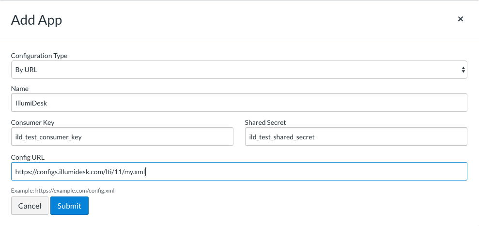
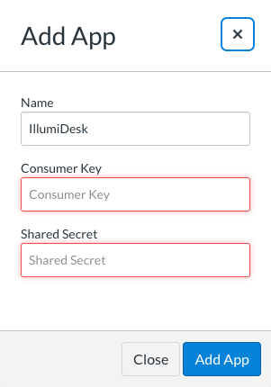

# Canvas with LTI v1.1

## Overview

You may either use the IllumiDesk application available in the **App Center** or install the application using the **By URL** configuration type option. 


Most Canvas instances do not surface all applications available in the **App Center** by default so you will most likely install IllumiDesk with the **Configuration Type --&gt; By URL** option. 


For testing, refer to the [test environment keys](./#test-environment) to complete the steps below.

## Option 1 - Install IllumiDesk as an External Application

1. If you need to manually install the IllumiDesk application, navigate to **Course --&gt; Settings --&gt; Apps --&gt; +App.**
2. Select the **Configuration** `URL` as the **Configuration Type.**
3. Enter the provided **Consumer Key**, **Shared Secret** and **Config URL** into the form.
4. Click **Submit** to save your application settings.

You may have access to Canvas's full list of available applications located within Canvas's **App Center**. It's more common, however, that your instance's configuration settings have permissions to install IllumiDesk as an **external application**. Have your LMS administrator refer to one of the options below to enable the IllumiDesk tool with your course.

## Option 2 - Install IllumiDesk from the App Center

If you or your LMS administrator has access to the IllumiDesk App Center applications, then the configuration URL for the shared \(multi-tenant\) is already included by default. The App Center surfaces applications registered with the [Eduappcenter](https://eduappcenter.com) portal.

1. To install IllumiDesk from the App Center, navigate to **Course --&gt; Settings --&gt; Apps --&gt; View App Center.**
2. Type `illumidesk` in the search text field
3. Click on the **IllumiDesk** application icon
4. Click on the **+ Add App** button
5. Enter the consumer key and shared secret in the available modal
6. Confirm by clicking on Add App


If you would like to take advantage of IllumiDesk's latest features then we recommend installing IllumiDesk with the newer LTI 1.3 standard.




