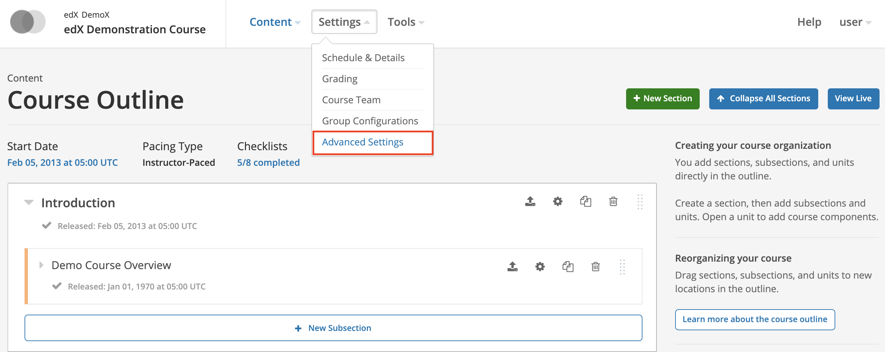
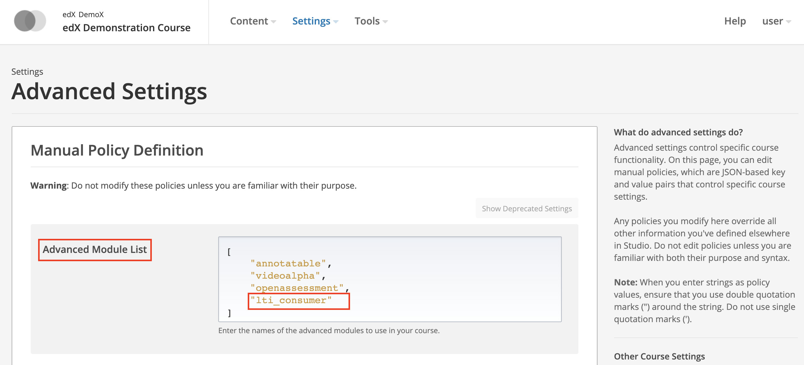
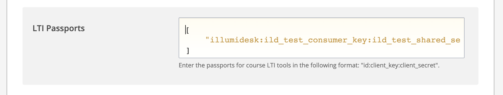
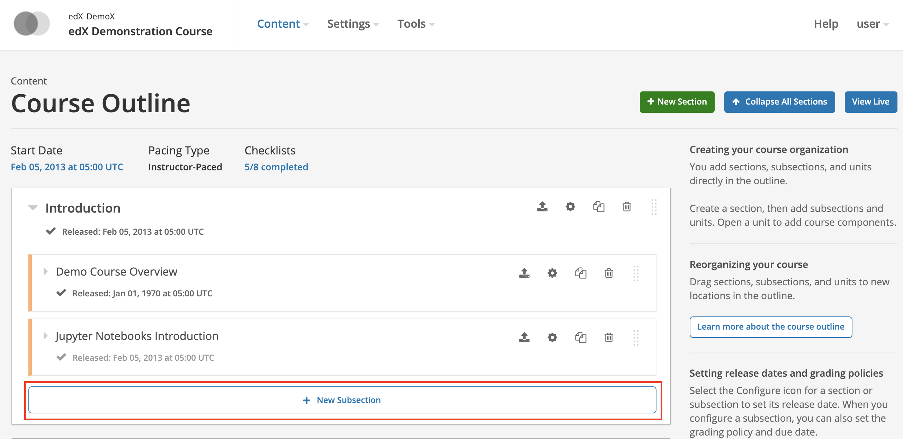
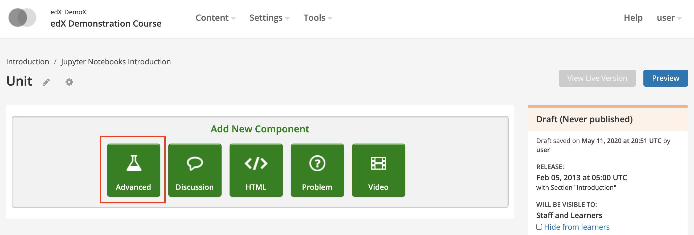
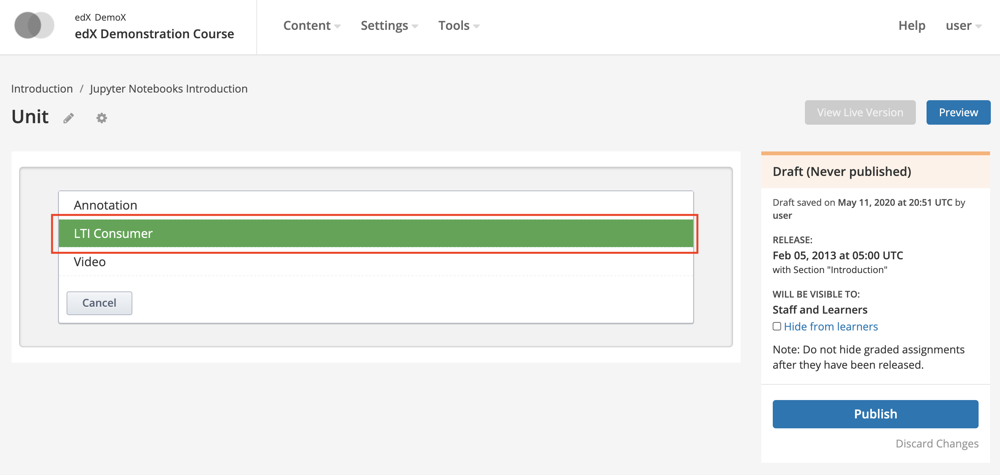
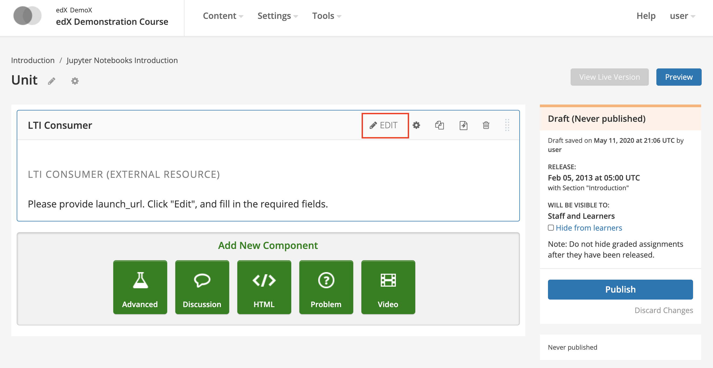
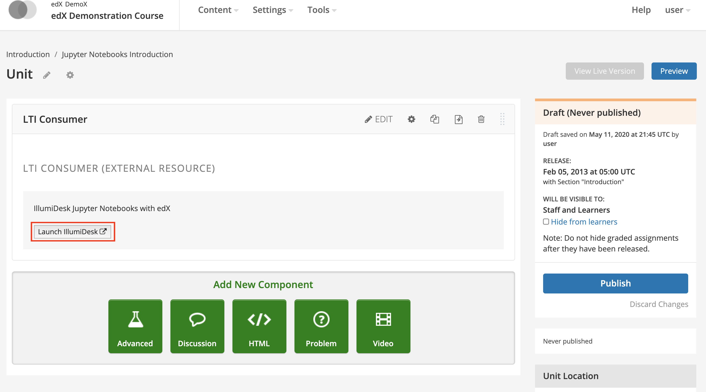

# Open edX with LTI v1.1

## Overview

For testing, refer to the [test environment keys](./#test-environment) to complete the steps below.


[Refer to Open edX's official LTI documentation](https://edx.readthedocs.io/projects/open-edx-building-and-running-a-course/en/latest/exercises_tools/lti_component.html) for more detailed installation and configuration options.


## Install IllumiDesk as an External Tool

To install IllumiDesk with **Open edX** you will need to access the **Open edX Studio** with a user that has privileges to update the application's setup. If you are logging in the for the first time, you may see an **Open edX Demonstration Course** in the Studio's home page. If not, create a new course by clicking on the `+ New Course` button. Then access your course and follow the steps below to activate **IllumiDesk as a tool provider** with **Open edX**.

1. Log into the Studio and access an existing course or create a new course by clicking on the + New Course button.


2. Click on the **Settings** dropdown and select **Advanced Settings** in the course's home page.



3. In the **Advanced Module List** section, add the **"lti\_consumer"** key \(include quotes\).



4. In the LTI Passports section, add the LTI tool's name, consumer key, and shared secret separated by commas. Each value should include quotes. For example:

```text
[
    "illumidesk:ild_test_consumer_key:ild_test_shared_secret"
]
```



4. Click on the **Save** button to update your Settings.

5. With Open edX, LTI tools are added within a **Course --&gt; Section --&gt; Sub Section --&gt; Unit**. Ensure that you have a **Section** within your course and then add a new **Subsection** by clicking on the **+ Subsection** button.



6. Then, add a new **Unit** within your **Subsection** by clicking on the **+Unit** button. This will display a set of green action buttons to configure your Unit. Click on the **Advanced** button.



7. Select the **LTI Consumers** option from the selection pane.



8. Selecting the **LTI Consumer** option will add the LTI Consumer to your Unit. Click on the **Edit** button to add the final touches to **IllumiDesk's LTI Consumer** configuration.



9. Add values for the LTI Consumer settings form. Some items, such as Inline Height, are not applicable so have been removed from the list below.

<table>
  <thead>
    <tr>
      <th style="text-align:left">Field Name</th>
      <th style="text-align:left">Description</th>
      <th style="text-align:left">Example</th>
    </tr>
  </thead>
  <tbody>
    <tr>
      <td style="text-align:left"><b>Display Name</b>
      </td>
      <td style="text-align:left">The display name you wish to provided to course participants, for example
        IllumiDesk.</td>
      <td style="text-align:left">IllumiDesk</td>
    </tr>
    <tr>
      <td style="text-align:left">
        <p></p>
        <p><b>LTI Application Information</b>
        </p>
      </td>
      <td style="text-align:left">The application&apos;s description.</td>
      <td style="text-align:left">IllumiDesk Jupyter Notebooks with Open edX</td>
    </tr>
    <tr>
      <td style="text-align:left">
        <p></p>
        <p><b>LTI ID</b>
        </p>
      </td>
      <td style="text-align:left">The LTI ID entered in the Passports section of the course&apos;s Advanced
        Settings page.</td>
      <td style="text-align:left">illumidesk</td>
    </tr>
    <tr>
      <td style="text-align:left">
        <p>&lt;b&gt;&lt;/b&gt;</p>
        <p><b>LTI URL</b>
        </p>
      </td>
      <td style="text-align:left">IllumiDesk&apos;s launch URL</td>
      <td style="text-align:left">https://my.illumidesk.com/hub/lti/launch</td>
    </tr>
    <tr>
      <td style="text-align:left"><b>Custom Parameters</b>
      </td>
      <td style="text-align:left">A key/value pair for any custom parameters. You may use variable substitution
        such to send information from the Open edX LMS to map it to standard LTI
        parameters.</td>
      <td style="text-align:left">[ &quot;email=$Person.email.primary&quot; ]</td>
    </tr>
    <tr>
      <td style="text-align:left"><b>LTI Launch Target</b>
      </td>
      <td style="text-align:left">Use <b>New Window</b> to launch IllumiDesk is a new browser tab.</td>
      <td
      style="text-align:left">New Window</td>
    </tr>
    <tr>
      <td style="text-align:left"><b>Button Text</b>
      </td>
      <td style="text-align:left">Button label that users see to launch LTI Consumer tool</td>
      <td style="text-align:left">Launch IllumiDesk</td>
    </tr>
    <tr>
      <td style="text-align:left"><b>Scored</b>
      </td>
      <td style="text-align:left">Set to True if you would like to receive grades from IllumiDesk&apos;s
        grader console</td>
      <td style="text-align:left">True</td>
    </tr>
    <tr>
      <td style="text-align:left"><b>Weight</b>
      </td>
      <td style="text-align:left">The score&apos;s weight as a floating point number between <code>0.0</code> and <code>1.0</code>.</td>
      <td
      style="text-align:left">1.0</td>
    </tr>
  </tbody>
</table>
The LTI Consumer has descriptions for each item and links to Open edX's official documentation with more information.


10. After you have saved your configuration, test the IllumiDesk application launch by clicking on the unit's launch button.



11. To complete your installation click on the **Publish** button. 

