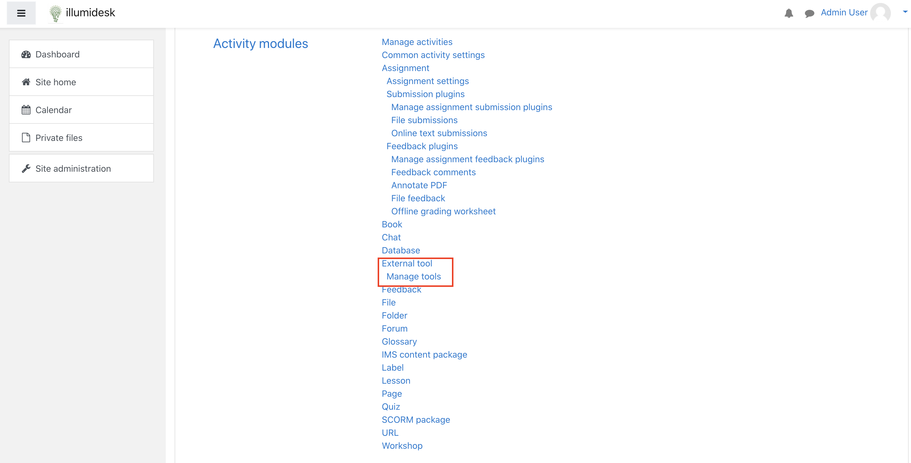
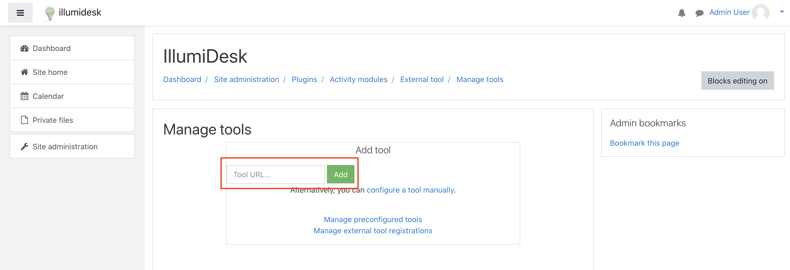
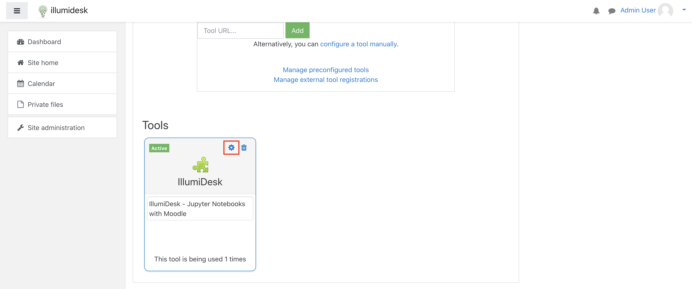
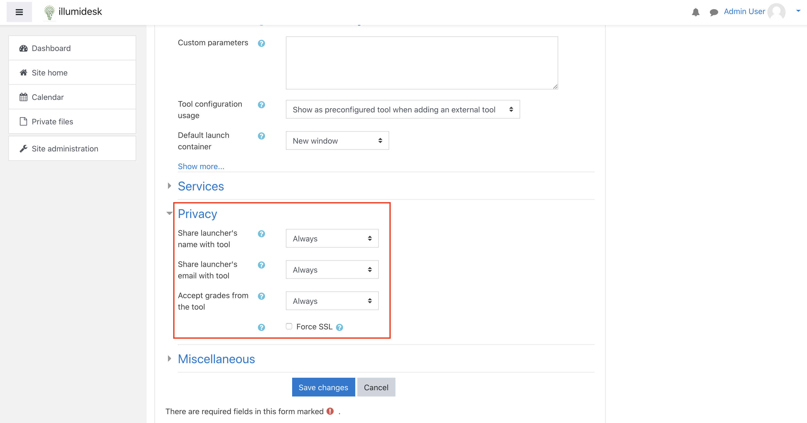
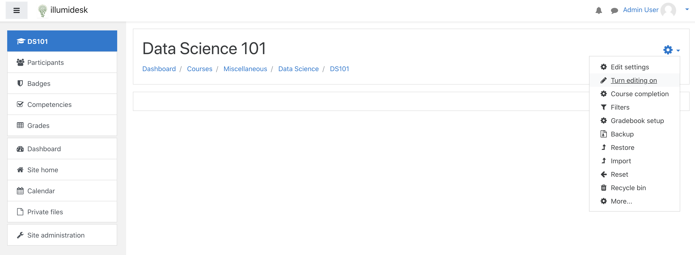
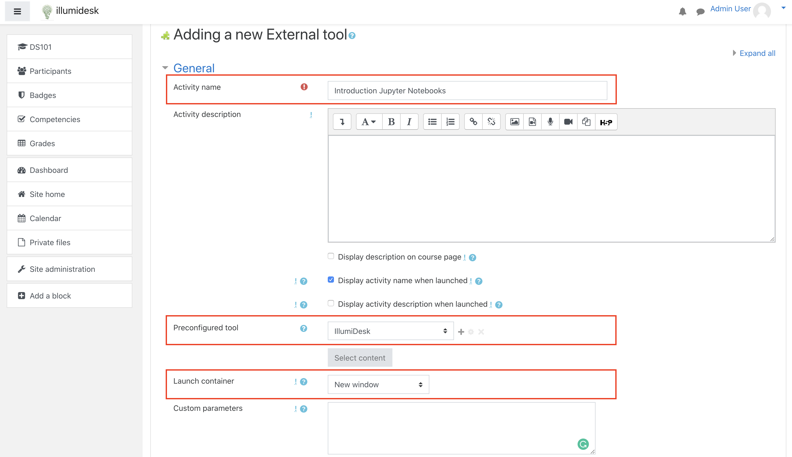

# Moodle with LTI v1.1

## Overview

For testing, refer to the [test environment keys](./#test-environment) to complete the steps below.

## Install IllumiDesk as an External Tool

To install IllumiDesk with **Moodle** you will need to access your environment with the **Admin** role. Once installed and activated, the IllumiDesk external tool may be added to any number of courses within your Moodle instance.

1. Log in with a user that has **Admin** privileges. Then, click on **Site Administration -&gt; Plugins -&gt; Plugins Overview -&gt; Activity Modules -&gt; External Tool -&gt; Manage tools.**

1. In the **Manage Tools** section, enter the **XML Configuration URL** into the **Add Tool** field.

1. Click on the **Add** button to update your Moodle instance with the new LTI tool.
2. Update the **External Tool** settings by clicking on the gear icon in the tool's card.

1. In the **Privacy Settings** section, select **Always** for **Share launcher's name with tool**, **Share launcher's email with tool**, and **Accept grades from the tool**.


**Privacy Settings --&gt; Accept Grades** from the tool option is necessary for Moodle to accept grade submissions from IllumiDesk's grader.


1. Navigate to your course and select **Turn Editing on** from the settings context menu.

1. Select **Add an activity or resource.**
2. In the Add an activity or resource form, add:
3. **Activity Name**
4. Select **IllumiDesk** from **Preconfigured Tool** dropdown
5. Select **New Window** from **Launch container**.

1. Click on **Save and return to course** or **Save and display** button to complete the tool's setup.

