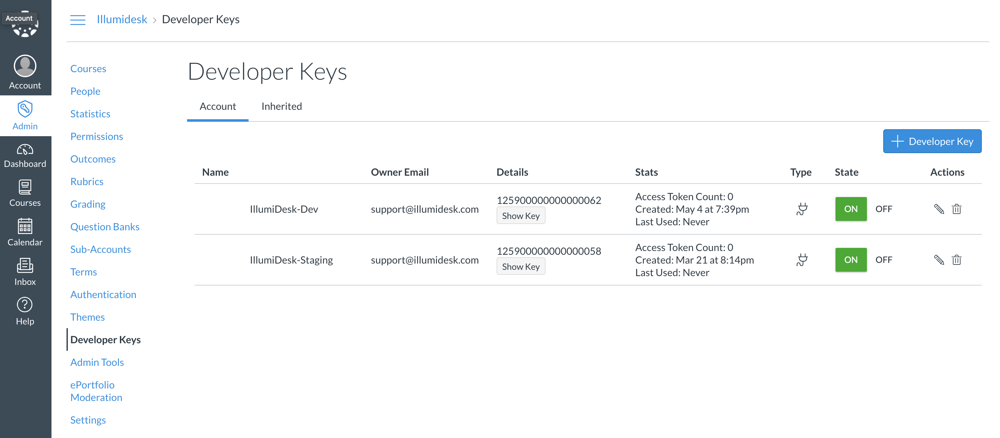
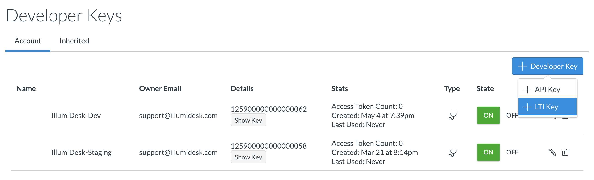
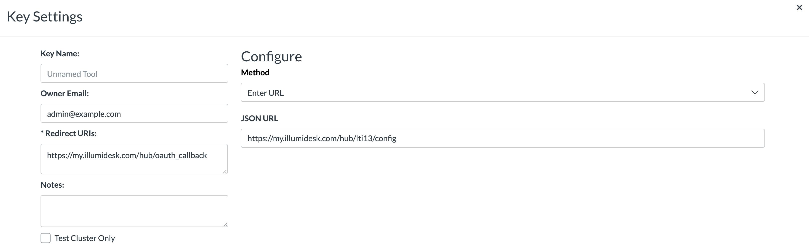
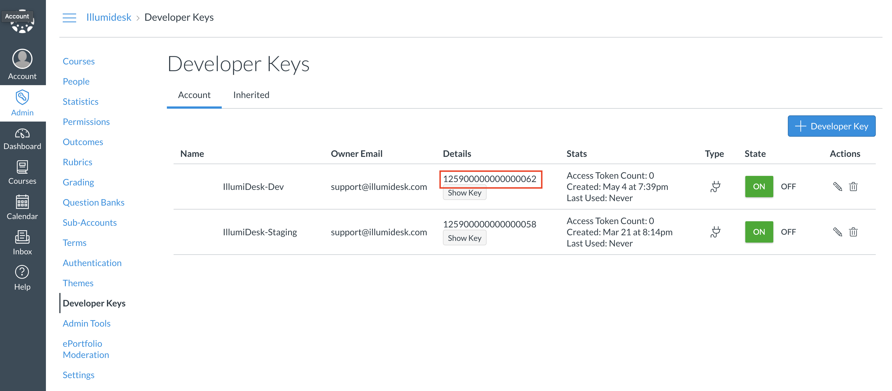
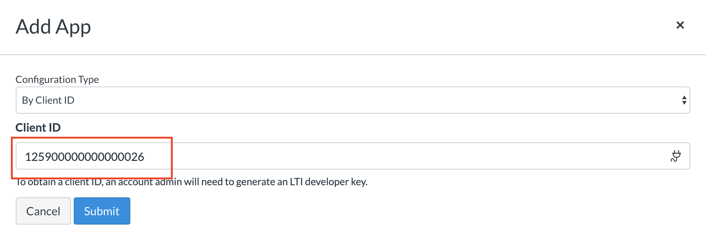
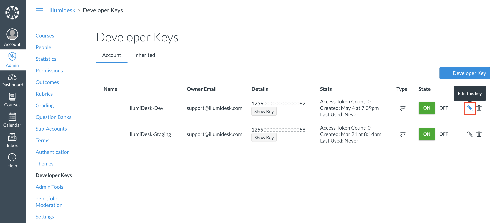

# Canvas with LTI v1.3

## Overview

The Canvas LMS requires the installation of a **Developer Key.** This Developer Key creates an identifier known as a **Client ID**. The combination of the client id and the tool's public key is used to establish a trusted relationship with between the tool and the consumer \(in this case IllumiDesk and the Canvas LMS, respectively\).


These steps are usually completed by the LMS's administrator.


## Create the Developer Key with URL Configuration Option

The **URL Configuration** option is a JSON file that contains the application's configuration settings as well as the JSON Web Key \(JWK\). The JWK is a public key that is used to verify signed requests from the tool.


Please refrain from using the Manual option to create a new Developer Key. The IllumiDesk tool requires a launch into a new window for the best user experience. There have also been reports of [SameSite cookie](https://developer.mozilla.org/en-US/docs/Web/HTTP/Headers/Set-Cookie/SameSite#Secure) errors with the latest browser versions.


1. Navigate to **Admin -&gt; Developer Keys**



1. Click on the **+ Developer Key** button and select the **+ LTI Key**:



1. In **Key Settings**, select **Method -&gt; Enter URL** and copy/paste the LTI 1.3 configuration link:

```text
https://my.illumidesk.com/hub/lti13/config
```

All fields will populate except the Redirect URIs field. The Redirect URI should have:

```text
https://my.illumidesk.com/hub/oauth_callback
```

The **Key Settings** should look like the screenshot below:



Also, enter an identifiable key name and, optionally, an owner email to identify the application owner within your organization.


Customers with dedicated environments use a **custom sub-domain** to identify their environment. To use a custom domain, replace **my.illumidesk.com** with **&lt;custom\_sub-domain&gt;.illumidesk.com**.



All settings are populated automatically by interpreting the JSON configuration file except for the **Redirect URIs** field. Ensure that you have added the correct value to this field before proceeding to the next steps.


1. Take note of the value in the **Account --&gt; Details** column of the **Developer Keys** page. You will need this value, known as the **Client ID**, when installing the IllumiDesk application within your course.



## Add Application to Course

With the **Client ID** in hand, navigate to the Course where you wish to activate the IllumIDesk application.

1. Click on **&lt;Course Name&gt; --&gt;** **Settings --&gt; Apps --&gt; View App Configurations --&gt; + Add** to open the **Add App** form where **&lt;Course Name&gt;** corresponds to the course's name \(also known as course label\) within your Canvas account.
2. Select **By Client ID** in the **Configuration Type** dropdown menu. Add the **Client ID** obtained **Step 4**.



1. Click **Submit** to update your course with the IllumiDesk application.
2. Sent the **Client ID's** value to [support@illumidesk.com](mailto:support@illumidesk.com). An IllumiDesk representative will update the environment with the **Client ID** key to complete the installation.

That's it! Once IllumiDesk is activated within your course all data will securely sync between systems using the LTI 1.3 standard.

## **Update an Existing Developer Key**

If you would like to update the Developer Key's settings then there are two options:

* Update the Developer Key settings with the settings form.
* Update the Developer Key with a new JSON configuration file.
* Click on the **Edit** icon to update your Developer Key




Some customers report that updating an existing developer key with a new JSON configuration file does not update the developer key's settings. In these cases customers will need to [create a new Developer Key](canvas-lms-lti13.md#create-the-developer-key-with-url-configuration-option) which reflects the updated settings.


The fields below contain a summary of the application's settings with sensible defaults. For custom domains, replace the `my` portion of the `my.illumidesk.com` domain with your custom sub-domain.

| Field Name | Value |
| :--- | :--- |
| **Redirect URI** | \[[https://my.illumidesk.com/hub/oauth\_callback](https://my.illumidesk.com/hub/oauth_callback) |

\]\([https://my.illumidesk.com/hub/oauth\_callback](https://my.illumidesk.com/hub/oauth_callback)

\) \| \| **Target Link URI** \| \[[https://my.illumidesk.com/hub](https://my.illumidesk.com/hub) \]\([https://my.illumidesk.com/hub](https://my.illumidesk.com/hub)

\) \| \| **OpenID Connect Initiation Url** \| \[[https://my.illumidesk.com/hub/oauth\_login](https://my.illumidesk.com/hub/oauth_login) \]\([https://my.illumidesk.com/hub/oauth\_login](https://my.illumidesk.com/hub/oauth_login)

\) \| \| **LTI Advantage Services** \| \(Recommended\) Toggle all options to the on position. \| \| **JWK Method** —&gt; **Public JWK URL** \| \[[https://my.illumidesk.com/hub/lti13/jwks](https://my.illumidesk.com/hub/lti13/jwks) \]\([https://my.illumidesk.com/hub/jwks](https://my.illumidesk.com/hub/jwks)

\) \| \| **Privacy Settings** \| `Public` \| \| **Placements** \| `Course Navigation`, `Assignment Selection` \| \| **Course Navigation** —&gt; **Target Link URI** \| \[[https://my.illumidesk.com/hub/](https://my.illumidesk.com/hub/) \]\([https://my.illumidesk.com/hub/](https://my.illumidesk.com/hub/)

\) \|

That's it! Once IllumiDesk is activated within your course all data will securely sync between systems using the LTI 1.3 standard.

Interested? Click on the link below to request your trial account today!



## What's Next?

Now that you have your LMS set up with IllumiDesk you can start creating your first course.

